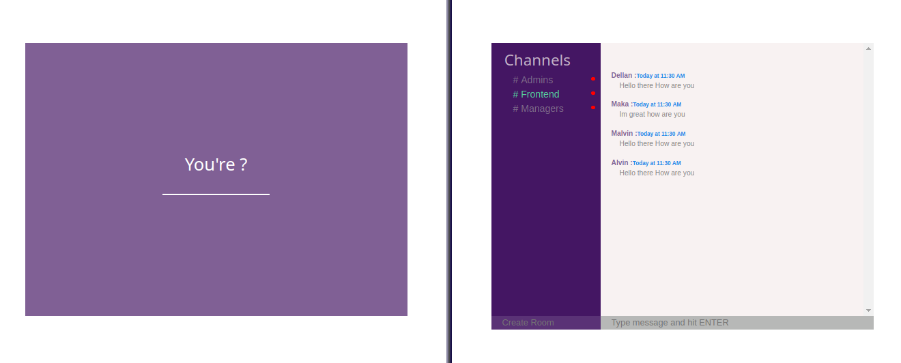
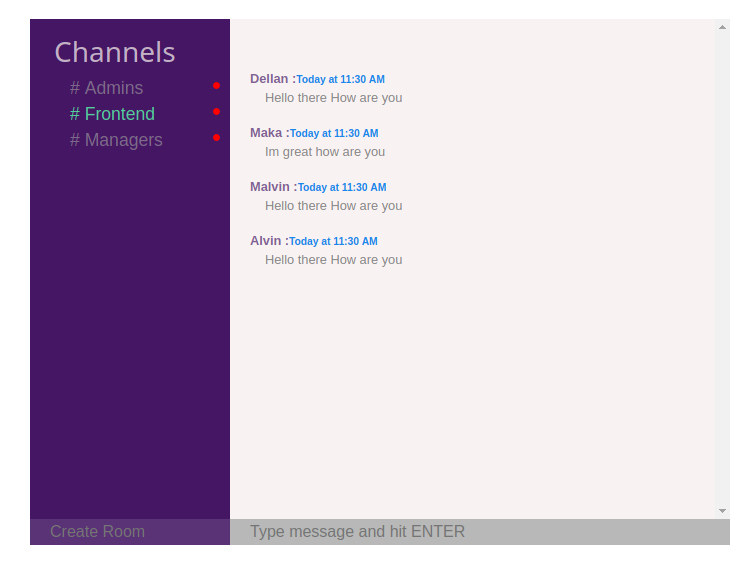
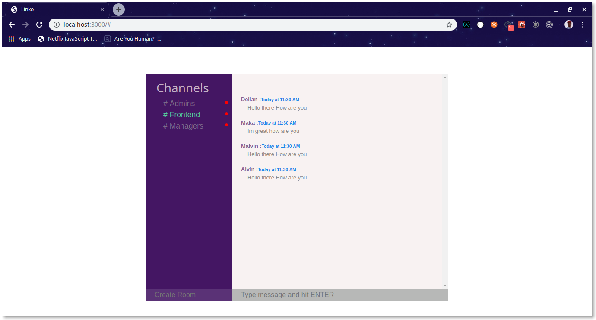

# Realtime web chat application
an application where users can signup with any username and start chatting

## user stories
1. user can login with a username
2. user can create a room
3. user can send and receive messages in different rooms

## Dependencies
- React.js
- Context API for statement
- Socket.i0-client
- react-string

## Sample video

## Screenshots

